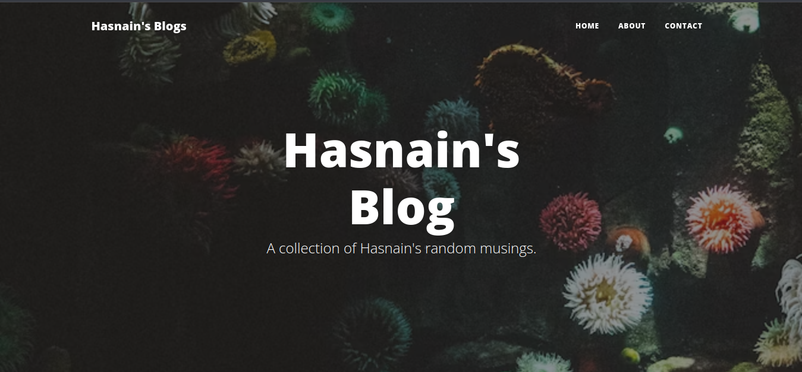

# Blog Website

#### This is a simple Blog Website project I made using HTML CSS Bootstrap for frontend and Flask a backend server. The data used in blogs is get using a third party API sevice [n:point](https://www.npoint.io/)

